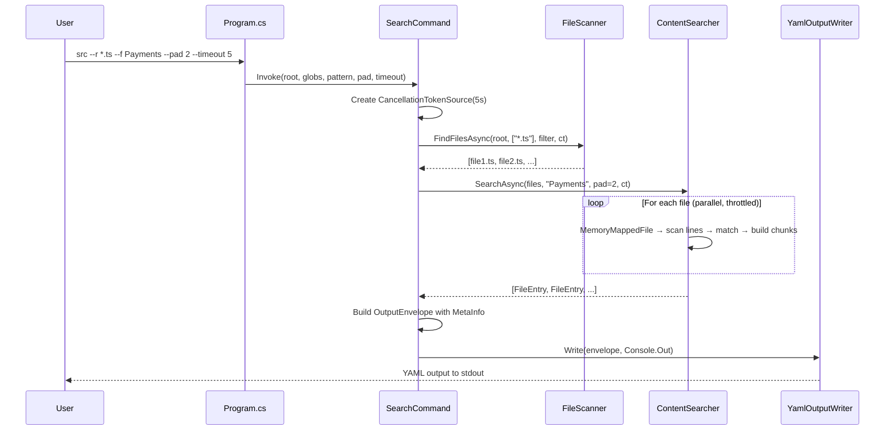

# Design Document — `src` CLI

## Overview

`src` is a native AOT-compiled .NET 10 CLI tool for fast source code interrogation. It supports three modes — directory hierarchy, file listing with glob matching, and parallel content search — all emitting structured YAML. The design prioritizes startup speed, memory efficiency (via memory-mapped I/O), and throughput (via task-based parallelism).

The project uses:
- **System.CommandLine** (2.0.0-beta5+) — AOT-compatible CLI parsing with rich help generation
- **YamlDotNet** (16.x) with its source generator — AOT-compatible YAML serialization
- **.NET built-in APIs** — `MemoryMappedFile`, `Parallel.ForEachAsync`, `Channel<T>`, `CancellationTokenSource`, `Regex` (compiled/source-generated where possible)

## Architecture

```
┌─────────────────────────────────────────────────────┐
│                     Program.cs                      │
│            (entry point, command setup)              │
└──────────────────────┬──────────────────────────────┘
                       │
                       ▼
┌─────────────────────────────────────────────────────┐
│               Commands Layer                        │
│  ┌──────────┐  ┌──────────┐  ┌──────────────────┐  │
│  │ ScanCmd  │  │ SearchCmd│  │ HelpCmd (builtin)│  │
│  └────┬─────┘  └────┬─────┘  └──────────────────┘  │
└───────┼──────────────┼──────────────────────────────┘
        │              │
        ▼              ▼
┌─────────────────────────────────────────────────────┐
│               Services Layer                        │
│  ┌────────────────┐  ┌─────────────────────────┐    │
│  │ FileScanner    │  │ ContentSearcher         │    │
│  │ (dir/file enum)│  │ (mmap + parallel search)│    │
│  └────────────────┘  └─────────────────────────┘    │
└──────────────────────┬──────────────────────────────┘
                       │
                       ▼
┌─────────────────────────────────────────────────────┐
│               Output Layer                          │
│  ┌──────────────────────────────────────────────┐   │
│  │ YamlOutputWriter                             │   │
│  │ (serializes result models → YAML to stdout)  │   │
│  └──────────────────────────────────────────────┘   │
└─────────────────────────────────────────────────────┘
```

### Layered Responsibilities

| Layer | Responsibility |
|-------|---------------|
| **Program / Entry** | Wire up `System.CommandLine` root command, global options, and subcommands. Parse args, resolve services, invoke handler. |
| **Commands** | Thin handlers that validate parsed options, call into services, and hand results to the output writer. |
| **Services** | All business logic: directory traversal, glob matching, memory-mapped file reading, parallel content searching. |
| **Output** | Serialize result models to YAML via YamlDotNet source-generated serializer. Write to `Console.Out`. |

### Project Structure

```
src.csproj
Program.cs                         ← entry, command wiring
Commands/
  ScanCommand.cs                   ← --r (file/dir listing) handler
  SearchCommand.cs                 ← --f (content search) handler
Services/
  FileScanner.cs                   ← parallel directory/file enumeration
  ContentSearcher.cs               ← memory-mapped search engine
  GlobMatcher.cs                   ← glob pattern matching utility
  ExclusionFilter.cs               ← default + custom exclusion logic
Output/
  YamlOutputWriter.cs              ← YamlDotNet serialization
  YamlSerializerContext.cs         ← AOT source-generated serializer context
Models/
  ScanResult.cs                    ← directory/file hierarchy model
  SearchResult.cs                  ← content search results model
  FileEntry.cs                     ← individual file entry with contents
  FileChunk.cs                     ← matched chunk with line numbers
  MetaInfo.cs                      ← elapsed time, timeout flag, etc.
  OutputEnvelope.cs                ← top-level output wrapper
```

## Components and Interfaces

### 1. Program.cs — Entry Point

Configures the `RootCommand` with global options and subcommands using `System.CommandLine`:

```
RootCommand
├── Option<string?>    --root       (default: cwd)
├── Option<string[]?>  --r          (glob patterns)
├── Option<string?>    --f          (search pattern)
├── Option<int>        --pad        (default: 0)
├── Option<int?>       --timeout    (seconds, nullable = no timeout)
├── Option<string[]?>  --exclude    (extra exclusion patterns)
├── Option<bool>       --no-defaults (disable default exclusions)
├── Option<bool>       --regex      (treat --f as regex)
└── Option<bool>       --version
```

Behavior matrix:
- No `--r`, no `--f` → directory hierarchy mode (Requirement 2)
- `--r` only → file listing mode (Requirement 3)
- `--r` + `--f` → content search mode (Requirement 4)
- `--f` without `--r` → content search across all recognized source files

### 2. FileScanner

Responsible for fast, parallel enumeration of the file system.

```csharp
public sealed class FileScanner
{
    Task<ScanResult> ScanDirectoriesAsync(string root, ExclusionFilter filter, CancellationToken ct);
    Task<IReadOnlyList<string>> FindFilesAsync(string root, IReadOnlyList<string> globs, ExclusionFilter filter, CancellationToken ct);
}
```

Implementation notes:
- Uses `Directory.EnumerateDirectories` / `EnumerateFiles` with `SearchOption.TopDirectoryOnly` recursively, spawning tasks per directory for parallelism
- Alternatively uses `Parallel.ForEachAsync` over a `Channel<string>` of discovered directories
- Applies `ExclusionFilter` at each level to prune entire subtrees early
- `GlobMatcher` uses `FileSystemName.MatchesSimpleExpression` (built-in .NET) for glob matching — no external dependency needed

### 3. ContentSearcher

The performance-critical component. Searches file contents using memory-mapped I/O and parallel processing.

```csharp
public sealed class ContentSearcher
{
    Task<IReadOnlyList<FileEntry>> SearchAsync(
        IReadOnlyList<string> filePaths,
        string pattern,
        bool isRegex,
        int padLines,
        CancellationToken ct);
}
```

Implementation notes:
- Throttles parallelism with `SemaphoreSlim` bounded to `2 * Environment.ProcessorCount`
- For each file:
  1. Open via `MemoryMappedFile.CreateFromFile` (read-only)
  2. Create a `MemoryMappedViewAccessor` or use `UnmanagedMemoryStream` + `StreamReader` for line-by-line reading
  3. Match each line against the pattern (pre-compiled `Regex` or `string.Contains` with `StringComparison.OrdinalIgnoreCase`)
  4. Collect matching line numbers
  5. Expand matches by `pad` lines, merge overlapping ranges
  6. Build `FileChunk` objects with line-numbered content
- For small files (< 64KB), falls back to `File.ReadAllLines` to avoid mmap overhead
- Pattern with `|` delimiter: split into multiple patterns, match if any hit (Requirement 4.3)

### 4. ExclusionFilter

```csharp
public sealed class ExclusionFilter
{
    bool IsExcluded(string directoryName);
    bool IsFileExcluded(string fileName);
}
```

Default exclusion set: `node_modules`, `.git`, `bin`, `obj`, `dist`, `.vs`, `__pycache__`, `.idea`, `.vscode`, `.svn`, `.hg`, `coverage`, `.next`, `.nuxt`, `target`, `build`, `packages`.

Can be extended via `--exclude` or cleared via `--no-defaults`.

### 5. GlobMatcher

Thin wrapper around `FileSystemName.MatchesSimpleExpression` from `System.IO.Enumeration`:

```csharp
public static class GlobMatcher
{
    bool Matches(string fileName, ReadOnlySpan<char> pattern);
    bool MatchesAny(string fileName, IReadOnlyList<string> patterns);
}
```

### 6. YamlOutputWriter

Uses YamlDotNet with a source-generated `StaticSerializerBuilder` for AOT compatibility.

```csharp
public sealed class YamlOutputWriter
{
    void Write(OutputEnvelope result, TextWriter output);
}
```

The `YamlSerializerContext` class is decorated with `[YamlStaticContext]` and registers all model types for source generation.

### 7. Commands (ScanCommand / SearchCommand)

Thin orchestrators:

```
ScanCommand:
  1. Resolve root, build ExclusionFilter
  2. Start stopwatch, create CancellationTokenSource (timeout)
  3. If no --r patterns: call FileScanner.ScanDirectoriesAsync → ScanResult
     If --r patterns: call FileScanner.FindFilesAsync → file list
  4. Wrap in OutputEnvelope with MetaInfo
  5. Pass to YamlOutputWriter

SearchCommand:
  1. Resolve root, build ExclusionFilter
  2. Start stopwatch, create CancellationTokenSource (timeout)
  3. Call FileScanner.FindFilesAsync to get candidate files
  4. Call ContentSearcher.SearchAsync with candidates + pattern
  5. Wrap in OutputEnvelope with MetaInfo
  6. Pass to YamlOutputWriter
```

## Data Models

### OutputEnvelope

```csharp
public sealed class OutputEnvelope
{
    public MetaInfo? Meta { get; init; }
    public IReadOnlyList<FileEntry>? Files { get; init; }
    public ScanResult? Tree { get; init; }
    public string? Error { get; init; }
}
```

### MetaInfo

```csharp
public sealed class MetaInfo
{
    public long ElapsedMs { get; init; }
    public bool Timeout { get; init; }
    public int FilesScanned { get; init; }
    public int FilesMatched { get; init; }
}
```

### FileEntry

```csharp
public sealed class FileEntry
{
    public required string Path { get; init; }
    public string? Contents { get; init; }
    public string? Error { get; init; }
    public IReadOnlyList<FileChunk>? Chunks { get; init; }
}
```

### FileChunk

```csharp
public sealed class FileChunk
{
    public int StartLine { get; init; }
    public int EndLine { get; init; }
    public required string Content { get; init; }
}
```

### ScanResult

```csharp
public sealed class ScanResult
{
    public required string Name { get; init; }
    public IReadOnlyList<ScanResult>? Children { get; init; }
    public IReadOnlyList<string>? Files { get; init; }
}
```

## Error Handling

| Scenario | Behavior |
|----------|----------|
| **Invalid arguments** | System.CommandLine displays error + usage. Exit code 1. |
| **Root path doesn't exist** | Print YAML with top-level `error:` field. Exit code 1. |
| **Permission denied on directory** | Skip directory, continue scan. No error surfaced unless it's the root. |
| **Permission denied / locked file** | Set `error` field on that `FileEntry`, continue with remaining files. |
| **Binary / unreadable file** | Skip file (detect via null-byte heuristic in first 8KB). |
| **Timeout exceeded** | Cancel all work via `CancellationToken`. Return partial results with `meta.timeout: true`. Exit code 2. |
| **Ctrl+C / SIGINT** | Hook `Console.CancelKeyPress`, trigger same cancellation path as timeout. Return partial results. Exit code 130. |
| **Regex parse error** | Print YAML with `error: "Invalid regex: ..."`. Exit code 1. |
| **No matches found** | Return valid YAML with empty `files: []` and `meta` populated. Exit code 0. |

### Exit Codes

| Code | Meaning |
|------|---------|
| 0 | Success (including "no matches") |
| 1 | User error (bad args, bad path, bad regex) |
| 2 | Timeout (partial results returned) |
| 130 | Cancelled via SIGINT |

## Performance Considerations

1. **Startup**: AOT eliminates JIT. Target < 50ms cold start.
2. **Directory traversal**: Parallel recursive enumeration. Early pruning via exclusion filter avoids wasted I/O.
3. **File reading**: Memory-mapped I/O for files > 64KB. Direct `ReadAllLines` for small files (mmap setup overhead exceeds benefit for tiny files).
4. **Search**: Pre-compiled `Regex` (or `SearchValues<string>` on .NET 10 for literal multi-pattern). `Parallel.ForEachAsync` with bounded concurrency.
5. **Output**: Single-pass YAML serialization via source-generated serializer — no reflection, no allocations beyond the output string.
6. **Memory**: Chunks are built per-file and serialized immediately where possible. Large repos won't accumulate all results in memory before writing.

## Dependencies

| Package | Version | License | Purpose |
|---------|---------|---------|---------|
| System.CommandLine | 2.0.0-beta5 | MIT | CLI parsing, help generation |
| YamlDotNet | 16.x | MIT | YAML serialization with AOT source generator |

Both are MIT-licensed and AOT-compatible.

## Diagram: Content Search Flow


