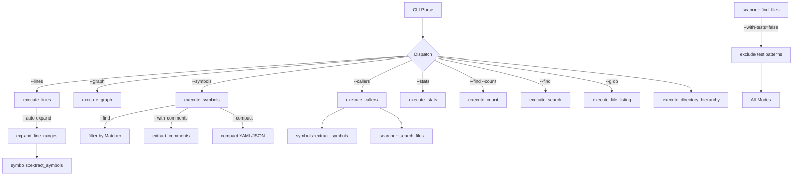

# Design Document — Symbol Enhancements

## Overview

Six features that turn `--symbols` from a passive index into an active code understanding pipeline. All six are additive — they extend existing data structures and pipelines rather than replacing them. The core principle: symbols already know where every declaration starts and ends, so we leverage that data to power filtering, cross-referencing, comment extraction, and auto-expansion.

#[[file:requirements.md]]

## Architecture

The current dispatch chain in `main.rs` (lines 131-147) follows a priority waterfall:

```
--lines > --graph > --symbols > --stats > --find --count > --find > --glob > tree
```

After this work, the chain becomes:

```
--lines (+ --auto-expand) > --graph > --callers > --symbols (+ --find, --compact, --with-comments) > --stats > --find --count > --find > --glob > tree
```

Key architectural decisions:

1. `--symbols --find` is a single combined mode, not two separate ones. The mutual exclusion logic treats `symbols_with_find` as one entry. The `--find` flag without `--symbols` remains a content-search mode.

2. `--callers` is a new top-level mode that internally runs both the symbol pipeline (to find declarations) and the search pipeline (to find references). It gets its own `execute_callers` function and a new `CallersOutput` model.

3. `--compact`, `--with-comments`, and `--with-tests` are modifier flags that affect existing modes. They don't create new execution paths — they parameterize existing ones.

4. `--auto-expand` is a modifier on `--lines` that optionally pre-processes line specs by running symbol extraction on each target file to find enclosing boundaries.

5. `--with-tests` is a scanner-level filter. It operates after glob matching and exclusion filtering, before files are handed to any mode's processing function. This keeps each mode's code clean.



## Components and Interfaces

### 1. CLI Changes (`cli.rs`)

New fields on `CliArgs`:

```rust
pub struct CliArgs {
    // ... existing fields ...
    pub callers: Option<String>,   // --callers <name>
    pub compact: bool,             // --compact
    pub with_comments: bool,       // --with-comments
    pub with_tests: bool,          // --with-tests (default: false)
    pub auto_expand: bool,         // --auto-expand
}
```

The `parse_args` function gains five new match arms. The mutual exclusion logic is updated:

- `--symbols` combined with `--find` is now allowed (they're one mode).
- `--callers` is mutually exclusive with all other modes.
- Validation after parsing: `--compact` requires `--symbols`, `--with-comments` requires `--symbols`, `--auto-expand` requires `--lines`.

The `print_help` function gains entries for all six new flags.

### 2. Test File Filter (`scanner.rs`)

New function `is_test_file(path: &str) -> bool` that checks:

- Filename matches: `*_test.*`, `*_spec.*`, `test_*.*`, `*.test.*`, `*.spec.*`
- Directory matches: any path component is `tests`, `test`, `__tests__`, `spec`, `specs`

The existing `find_files` function gains an optional `include_tests: bool` parameter. When false, results are filtered through `is_test_file` before returning. This is the simplest integration point — every mode already calls `find_files`.

To avoid changing every call site's signature, we add a wrapper:

```rust
pub fn find_files_filtered(
    root: &Path,
    globs: &[String],
    filter: &ExclusionFilter,
    cancelled: &AtomicBool,
    include_tests: bool,
) -> Vec<String> {
    let files = find_files(root, globs, filter, cancelled);
    if include_tests {
        files
    } else {
        files.into_iter().filter(|f| !is_test_file(f)).collect()
    }
}
```

All `execute_*` functions in `main.rs` switch from `find_files` to `find_files_filtered`, passing `args.with_tests`.

For `execute_lines` (which uses explicit paths, not scanner), test filtering is NOT applied — explicit paths always win per Requirement 5.6.

For `scan_directories` (tree mode), test filtering is applied at the file level during directory walking.

### 3. Symbol Name Filtering (`symbols.rs` + `main.rs`)

The `execute_symbols` function gains a branch: if `args.find.is_some()`, build a `Matcher` from the find pattern, then after `symbols::extract_symbols`, filter each `SymbolFile`'s symbols to only those where `matcher.is_match(&sym.name)` is true. Drop files with zero remaining symbols.

New helper in `symbols.rs`:

```rust
pub fn filter_symbols(
    symbol_files: Vec<SymbolFile>,
    matcher: &Matcher,
) -> (Vec<SymbolFile>, usize) {
    let mut total_matches = 0usize;
    let filtered: Vec<SymbolFile> = symbol_files
        .into_iter()
        .filter_map(|mut sf| {
            sf.symbols.retain(|sym| matcher.is_match(&sym.name));
            if sf.symbols.is_empty() && sf.error.is_none() {
                return None;
            }
            total_matches += sf.symbols.len();
            Some(sf)
        })
        .collect();
    (filtered, total_matches)
}
```

The `meta` block gets `totalMatches` populated (reusing the existing `total_matches` field on `MetaInfo`).

### 4. Callers Mode (`callers.rs`)

New module: `callers.rs`. New models in `models.rs`:

```rust
pub struct CallerEntry {
    pub path: String,
    pub line: usize,
    pub content: String,
}

pub struct CallerFile {
    pub path: String,
    pub sites: Vec<CallerEntry>,
}

pub struct CallersOutput {
    pub declaration: Option<CallerDeclaration>,
    pub callers: Vec<CallerFile>,
}

pub struct CallerDeclaration {
    pub path: String,
    pub line: usize,
    pub signature: String,
}
```

The `OutputEnvelope` gains: `pub callers: Option<CallersOutput>`.

Algorithm for `execute_callers`:

1. Run `find_files_filtered` to get all source files.
2. Run `symbols::extract_symbols` to find the declaration of the given name. Match by exact name (case-sensitive). If multiple declarations exist (e.g., same name in different files), include all in the `declaration` list.
3. Build a `Matcher::Literal(name)` (or `Matcher::Regex` if `--regex`).
4. For each file, read content, find all lines matching the name. Exclude lines that are the declaration itself (match by file path + line number).
5. Group results by file, sort by path, emit.

This reuses `file_reader::read_file`, `searcher::Matcher`, and the parallel scan pattern from `count.rs`.

### 5. Compact Output (`yaml_output.rs`)

The `OutputEnvelope` gains a flag (or it's passed through the output functions): `compact_symbols: bool`.

In `write_symbols`, when compact is true, the kind-group headers are suppressed. Instead, each file gets a flat list:

```yaml
symbols:
- path: src/main.rs
  - fn main :26:29
  - fn run :31:53
  - fn execute :100:148
```

The `write_symbol_compact` function gets a compact branch:

```rust
fn write_symbol_compact(w: &mut impl Write, sym: &SymbolInfo, compact: bool) -> io::Result<()> {
    if compact {
        write!(w, "  - {} {} :{}:{}\n", sym.kind, sym.name, sym.line, sym.end_line)?;
    } else {
        write!(w, "  - ")?;
        write_inline_string(w, &sym.signature)?;
        write!(w, " :{}:{}\n", sym.line, sym.end_line)?;
    }
    Ok(())
}
```

For JSON compact, the symbol object emits only `kind`, `name`, `line`, `endLine` — no `signature`, `visibility`, `parent`.

The compact flag is threaded through `OutputEnvelope` as a field or via a separate output config struct.

### 6. Doc Comment Extraction (`lang/common.rs` + `lang/*.rs`)

New field on `SymbolInfo`:

```rust
pub struct SymbolInfo {
    // ... existing fields ...
    pub comment: Option<String>,
}
```

Default is `None`. When `--with-comments` is active, the symbol extraction pipeline populates this field.

Strategy: Rather than changing every language handler, we extract comments in a language-agnostic post-processing step in `symbols.rs`. After `handler.extract_symbols(&content)` returns, if `with_comments` is true, walk the content's lines backwards from each symbol's `line - 1` to collect the preceding comment block.

New function in `lang/common.rs`:

```rust
pub fn extract_preceding_comment(lines: &[&str], symbol_line_idx: usize) -> Option<String> {
    // Walk backwards from symbol_line_idx - 1
    // Collect contiguous comment lines (///, //, /*, *, #, etc.)
    // Stop at blank line, code line, or file start
    // Strip comment markers, join, return
}
```

Special case for Python: docstrings appear AFTER the `def`/`class` line, not before. The Python handler needs a small extension to detect `"""..."""` on the lines immediately following the declaration. This is handled by a `extract_docstring_after` variant.

Comment marker stripping rules:
- `///` or `//!` → strip prefix and one optional leading space
- `//` → strip prefix and one optional leading space
- `/*` / `*/` / ` *` → strip delimiters and leading `*` plus space
- `#` → strip `#` and one optional leading space
- `"""` / `'''` → strip triple-quote delimiters

The post-processing approach means zero changes to the `LangSymbols` trait interface. Existing handlers work unchanged. The comment extraction reads the same `content: &str` that was already loaded.

### 7. Auto-Expand (`lines.rs`)

New function in `lines.rs`:

```rust
pub fn expand_line_specs(
    specs: &[LineSpec],
    root: &Path,
    with_comments: bool,
) -> Vec<LineSpec> {
    // For each spec:
    // 1. Read the file
    // 2. Get the symbol handler for the file's extension
    // 3. Extract symbols
    // 4. Find the symbol whose range [start, end] contains spec.start
    // 5. Expand spec to [symbol.start (or comment start if with_comments), max(symbol.end, spec.end)]
    // 6. If no enclosing symbol found, return spec unchanged
}
```

This runs BEFORE `extract_lines`, so the existing line extraction code doesn't change at all. The specs are just pre-processed with wider ranges.

The function uses `lang::get_symbol_handler` and `file_reader::read_file` — both already available. For files with unsupported extensions, the spec passes through unmodified.

## Data Models

### New Models (`models.rs`)

```rust
pub struct CallerEntry {
    pub path: String,
    pub line: usize,
    pub content: String,
}

pub struct CallerFile {
    pub path: String,
    pub sites: Vec<CallerEntry>,
}

pub struct CallerDeclaration {
    pub path: String,
    pub line: usize,
    pub signature: String,
}

pub struct CallersOutput {
    pub declarations: Vec<CallerDeclaration>,
    pub files: Vec<CallerFile>,
}
```

### Modified Models

`SymbolInfo` (in `lang/mod.rs`):
- Add `pub comment: Option<String>` field. Default `None`.

`OutputEnvelope` (in `models.rs`):
- Add `pub callers: Option<CallersOutput>` field.
- Add `pub compact_symbols: bool` field (default `false`).

`CliArgs` (in `cli.rs`):
- Add `callers: Option<String>`, `compact: bool`, `with_comments: bool`, `with_tests: bool`, `auto_expand: bool`.

### Modified Enums / Constants

`scanner.rs`:
- Add `TEST_PATTERNS` constant for test file matching.
- Add `is_test_file` function.
- Add `find_files_filtered` wrapper.

## Error Handling

All error handling follows existing patterns:

1. Modifier flags without their required parent flag produce immediate CLI errors during `parse_args`:
   - `--compact` without `--symbols` → `"--compact requires --symbols"`
   - `--with-comments` without `--symbols` → `"--with-comments requires --symbols"`
   - `--auto-expand` without `--lines` → `"--auto-expand requires --lines"`

2. Mutual exclusion violations produce CLI errors listing the conflicting flags, same as today.

3. File-level errors during callers/symbols/auto-expand are collected into `errors:` arrays and `meta.filesErrored`, same as existing modes.

4. Timeout handling: all new features check `cancelled.load(Ordering::Relaxed)` in their loops and return partial results with `meta.timeout: true`.

5. Invalid regex in `--callers` with `--regex` produces the same error as `--find` with invalid regex.

6. Auto-expand failures (can't read file, unsupported extension) silently fall back to original spec — no error emitted, just no expansion.
