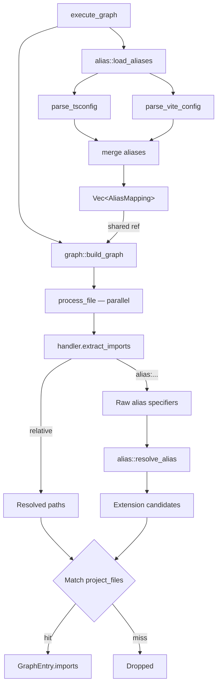

# Design Document — TypeScript Module Path Alias Resolution

## Overview

This feature adds automatic detection and resolution of TypeScript/JavaScript module path aliases (`@/`, `~/`, custom prefixes) in the `--graph` mode. It reads alias configuration from `tsconfig.json` and Vite config files, then resolves aliased import specifiers to real project files during graph construction.

The design follows Option A: alias resolution is performed in `graph.rs` (and a new `alias.rs` module), entirely outside the `LangImports` trait. No other language handler is modified.

#[[file:requirements.md]]

## Architecture

### Current Flow

```
graph::build_graph()
  └─ process_file()
       ├─ handler.extract_imports() → relative candidates only
       └─ Match candidates against project_files HashSet
```

### New Flow

```
execute_graph()
  ├─ alias::load_aliases(root)         ← one-time config scan
  └─ graph::build_graph(..., &aliases)
       └─ process_file(..., &aliases)
            ├─ handler.extract_imports() → relative + "alias:..." markers
            └─ For each candidate:
                 ├─ "alias:" → alias::resolve_alias() → probe extensions
                 └─ else → existing normalize + project_files check
```

### Key Design Decisions

1. Alias loading happens once per `--graph` invocation, before the parallel file scan.
2. The `"alias:"` prefix marker is an internal convention within the imports Vec. It lets `graph.rs` distinguish alias specifiers from resolved relative paths.
3. The TS handler still does its own relative resolution. It only emits raw alias specifiers for non-relative, non-npm paths.
4. npm scoped package detection: `@<lowercase-word>/<anything>` is treated as npm. Everything else starting with `@` is a potential alias.

## Components and Interfaces

### New Module: `src/alias.rs`

- `AliasMapping { prefix: String, targets: Vec<String> }`
- `load_aliases(root: &Path) -> Vec<AliasMapping>` — scans for tsconfig.json and vite.config.*
- `resolve_alias(specifier: &str, aliases: &[AliasMapping]) -> Vec<String>` — generates candidate paths
- `is_potential_alias(path: &str) -> bool` — distinguishes aliases from npm packages
- `is_npm_scoped_package(specifier: &str) -> bool`

### Modified: `src/lang/typescript.rs`

- `extract_imports` gains a third code path: if `is_potential_alias(path)` → emit `"alias:{path}"`

### Modified: `src/graph.rs`

- `build_graph` and `process_file` gain `aliases: &[AliasMapping]` parameter
- Candidate loop adds alias resolution branch

### Modified: `src/main.rs`

- Registers `mod alias`
- `execute_graph` calls `alias::load_aliases(root)` before `build_graph`

## Data Models

### AliasMapping

| Field | Type | Description |
|-------|------|-------------|
| `prefix` | `String` | Import prefix to match, e.g. `"@/"`, `"~/"` |
| `targets` | `Vec<String>` | Target dirs relative to root, e.g. `["src/"]` |

### tsconfig Parsing

Strip trailing `*` from key and value. Key becomes prefix, value becomes target directory. `baseUrl` is prepended to targets.

### Vite Parsing

Regex heuristics on file content. Object form (`'@': path.resolve(...)`) and array form (`{ find: '@', replacement: '...' }`).

## Error Handling

| Scenario | Behavior |
|----------|----------|
| Config not found | No-op, empty alias list |
| Config unreadable | Warn to stderr, empty list |
| Malformed config | Warn to stderr, empty list |
| Alias resolves to no file | Silently dropped |
| Ambiguous specifier | Include as candidate; harmless if no match |


